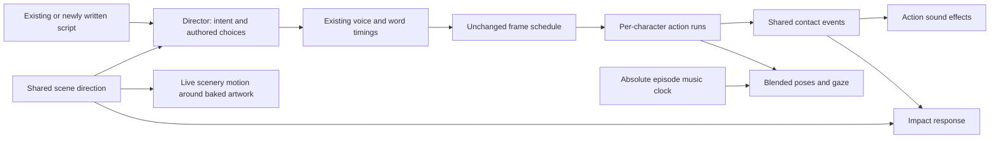

# Animation architecture

Implemented 2026-09-13 following [the research assessment](animation-research.md).

## Responsibilities



`scripts/lib/director.mjs` remains the engagement authority. Its optional `scene.direction` is one of `dialogue`, `demonstration`, `thinking`, `celebration`, `lullaby`, or `tender`. `src/lib/sceneDirection.mjs` supplies the same deterministic defaults to the Director and renderer, so existing scripts need no migration. Explicit valid direction wins; questions, sleep context, moral context and relevant actions guide defaults.

The Director preserves explicit off settings. `music:false`, `music:"none"`, and `gag:false` normalize to `null`, which remains disabled on every subsequent pass. Missing values can still be filled automatically. Quiet intent settles inferred actions, camera and transitions; it does not discard authored gestures, camera, energy or extras. Repeated choruses vary only eligible inferred actions. Automatically selected party guests come from the six canonical characters.

## Timing and acting

`src/lib/sceneMotion.ts` builds independent main/friend action tracks on the existing scene schedule. Consecutive identical gestures share a run. New actions blend from the outgoing pose over 0.22 seconds. Ordinary gesture changes wait for an airborne jump to land; superseded requests cannot overtake newer requests. Questions and reveals retain exact timing and can interrupt a jump through the short pose blend. No voice line or episode duration is extended.

`src/lib/actionMotion.ts` owns jump, clap and stomp phases, contact times, impact envelopes and safe jump boundaries. The rig, contact sound scheduler and camera response consume those calculations. Contact sounds follow actual runs, including delayed landings, and respect explicit empty SFX arrays. Repeated claps have no six-clap truncation.

Characters accept independent action, music and blink clocks. Music phase is absolute episode time, so rhythm continues across scene cuts. Stable canonical identity replaces scene-index seeds for episode characters; callers can still explicitly select a seed. Gaze reaches both storybook and legacy rigs. Pose blending retains signed spin orientation, and twist dancing keeps a readable frontal width.

The camera eases its focal point between speakers. Automatic line punches have been replaced by praise accents. Question scenes stop automatic close-up changes; an authored camera move remains authoritative. Corrected sequence offsets align camera/background clocks with the actual scene and episode clocks.

## Scenery and gags

The static scenery remains a cached PNG. Existing animated back/front layers receive small opposing offsets for depth; scene intent controls their parallax amplitude. This does not add a physics simulation, new particle system, or expensive per-frame scenery redraw. Existing ambient animations continue; the profile does not individually retime every background part.

Director-generated gags carry `auto:true`. The renderer searches for a three-second unvoiced window after their preferred time, excluding question thinking/reveal intervals. If no suitable window exists, that automatic gag is omitted. Authored gag times stay fixed when the gag fits inside the scene. Existing unmarked gags are treated as authored for compatibility.

## Verification

- 54 tests passed with `node --test tests/*.test.mjs` in isolated workers. Coverage includes Director reruns, all library scripts in memory, action continuity, contacts, delayed landings, quiet scenes, canonical identity and existing art/timing/calendar behavior.
- `npm run typecheck` passed.
- `node scripts/check-character-designs.mjs` checked all 38 recipes and importer preservation.
- The 56.5-second local review reel covers dialogue, jump handoffs, claps/stomps, questions, celebration, tender and lullaby direction. It has captions, music and effects, with no newly synthesized dialogue.
- Fifteen overlapping PNG frames were byte-identical between separately rendered ranges 420–449 and 435–449, covering a gesture handoff. This supplements frame-pure unit checks; it is not an exhaustive comparison of every episode frame.
- Independent review found quiet reprise and hold-dance regressions; both were reproduced, fixed and tested. Visual inspection found excessive twist narrowing; that was also corrected and tested.

Artifacts: `out/review/animation-architecture/motion-review.mp4`, `review-sheet.png`, `tests.log`, `timeline.json`, and `chunk-verification.json`. The development fixture is generated only under `public/generated/animation-architecture-review/`; no permanent library script was changed.

Local commands (with Chrome/subprocess permissions where required):

```sh
node --test tests/*.test.mjs
npm run typecheck
node scripts/check-character-designs.mjs
npx remotion render Video out/review/animation-architecture/motion-review.mp4 --props=out/review/animation-architecture/props.json --scale=0.5 --concurrency=4 --codec=h264
```

No dependencies, paid services, AI stages, CI timeouts, or cache steps were added or removed. No production episode was published. Remotion still emits the existing Zod 3/4 compatibility warning; the tested renders completed. Render-time change has not been benchmarked against an equivalent before-update build, and audience-retention improvement is unmeasured.
